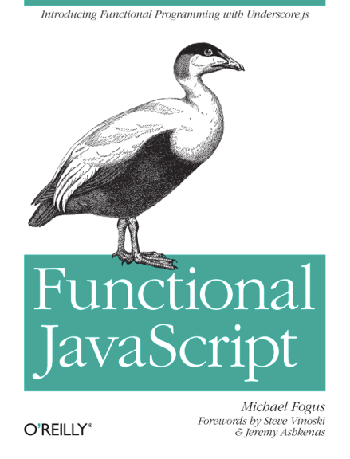

[](http://www.amazon.com/dp/B00D624AQO)

# Summary
Notes and code snippets while studying [Functional JavaScript](http://www.amazon.com/dp/B00D624AQO) by Michael Fogus, with the [Asheville Hacker Book Club](http://eepurl.com/4WaUf).

### Contents:
- [Preface](#preface)
- [Chapter 1](#chapter-1)
- [Chapter 2](#chapter-2)

# Preface

### code conventions:
- avoid assigning variables more than once
- no eval
- no monkey patching
- favor functions over methods


# Chapter 1

## the case for javascript:


### passing functions

> __[!]__ i often forget i can pass functions as parameters, without defining an anonymous function every time.

for example:

```javascript
// i tend to reach for this:
[1, 2, 3].forEach(function(n) {
  alert(n);
});

// and forget this:
[1, 2, 3].forEach(alert);

function note(message) {
  console.log(message);
}

function prettyNumber(n) {
  return 'Hello, I am the number ' + n;
}

// and this:
[1, 2, 3].map(prettyNumber)
         .forEach(note);

//=> Hello, I am the number 1
//=> Hello, I am the number 2
//=> Hello, I am the number 3
```
→ [__chapter-1/pass-the-func.js__](/chapter-1/pass-the-func.js)

### apply/call

i rarely use ``apply`` in practice, took me a minute to deconstruct example. here's an example with three arguments.

```javascript
function splat(fun) {
  return function(array) {
    return fun.apply(null, array);
  }
}

var addThree = splat(function(a, b, c) { return a + b + c; });
addThree([5, 10, 15]);
console.log(sum);
//=> 30
```
→ [__chapter-1/apply.js__](/chapter-1/apply.js)

> __[!]__ i forgot that the first argument to ``apply`` (and ``call``) is the value of ``this`` for ``fun``. i also forgot about magical ``arguments`` object. :)


### functions as units of abstraction

> __[?]__ i'm sure it's a contrived example, but the "functional" rewrite of ``parseAge`` relying on global functions ``fail``, ``warn`` and ``note`` freaks me out. maybe this will be addressed in chapter 3 on closures for "data hiding".

### functions as units of behavior

in the comparator example, ``truthy`` and ``falsey`` are not defined. here is a complete example:

```javascript
function exists(x) {
  return x!= null;
}

function truthy(x) {
  return (x !== false) && exists(x);
}

// comparator is a higher order function because
// it takes a function and returns a new function
function comparator(pred) {
  return function(x, y) {
    if (truthy(pred(x, y))) return -1;
    else if (truthy(pred(y, x))) return 1;
    else return 0;
  }
}

function lessThan(x, y) {
  return x < y;
}

function greaterThan(x, y) {
  return x > y;
}

function isEqual(x, y) {
  return x === y;
}

var resultAsc = [100, 1, 0, 10, -1, -2, -1].sort(comparator(lessThan));
console.log(resultAsc);
//=> [ -2, -1, -1, 0, 1, 10, 100 ]

var resultDesc = [100, 1, 0, 10, -1, -2, -1].sort(comparator(greaterThan));
console.log(resultDesc);
//=> [ 100, 10, 1, 0, -1, -1, -2 ]

var resultWat = [100, 1, 1, 0, 10, -1, -2, -1].sort(comparator(isEqual));
console.log(resultWat);
//=> [ 100, 1, 1, 0, 10, -1, -2, -1 ]
```
→ [__chapter-1/comparator.js__](/chapter-1/comparator.js)

> __[!]__ why does passing ``isEqual`` to ``comparator`` result in no sorting? because, ironically, when two numbers are ___not___ equal, comparator will return 0 (since first two comparisons via isEqual return false), thereby signally equality to sort. when two numbers _are_ equal, they will be swapped which is meaningless. hence no change.

### data as abstraction

in a footnote the author mentions that ECMAScript.next is discussing the _possibility_ of support for classes.

this is now a fairly solidified spec for ES6 using the ``class`` keyword.

```javascript
class Animal {
  constructor(name) {
    this.name = name;
    this.say(name + ' has been born!');
  }

  say(message) {
    console.log(message);
  }

  eat() {
    this.say('eating right now ...');
  }
}

class Cat extends Animal {
  meow() {
    this.say('meooow!');
  }
}

var cat = new Cat('sebastian');
cat.eat();
cat.meow();
//=> sebastian has been born!
//=> eating right now ...
//=> meoow!
```
→ [__chapter-1/es6-class.html__](/chapter-1/es6-class.html)

at this point author seems to assume familiarity with underscore, using ``_.reduce``, ``_.map`` and ``_.rest`` in example code without explanation. :/

in any case, tinkering with the implementation of ``lameCSV``:  
```javascript
function lameCSV(str) {
  var rows = str.split('\n');

  return _.reduce(rows, function(table, row) {
    var cols = row.split(',');

    table.push(_.map(cols, function(c) {
      return c.trim();
    }));

    return table;
  }, []);
}

var frameworks = 'framework, language, age\n ' +
                 'rails, ruby, 10\n' +
                 'node.js, javascript, 5\n' +
                 'phoenix, elixir, 1';

var table = lameCSV(frameworks);
console.log(table);
//=> [ [ 'framework', 'language', 'age' ],
//=>   [ 'rails', 'ruby', '10' ],
//=>   [ 'node.js', 'javascript', '5' ],
//=>   [ 'phoenix', 'elixir', '1' ] ]

var sorted = _.rest(table).sort();
console.log(sorted);
//=> [ [ 'node.js', 'javascript', '5' ],
//=>   [ 'phoenix', 'elixir', '1' ],
//=>   [ 'rails', 'ruby', '10' ] ]
```
→ [__chapter-1/lame-csv.js__](/chapter-1/lame-csv.js)

> __[?]__ _wait_, how did javascript sort that last array of arrays?

well, according to [Array.prototype.sort()](https://developer.mozilla.org/en-US/docs/Web/JavaScript/Reference/Global_Objects/Array/sort):
> elements are sorted by converting them to strings and comparing

```javascript
['node.js', 'javascript', '5'].toString();
//=> "node.js,javascript,5"
```

> __[!]__ again, the idea of passing functions to functions, while basic to javascript, is still not the most intuitive approach for my brain.

for example, it took me a minute to unpack this:

```javascript
function selectFrameworks(table) {
  return _.rest(_.map(table, _.first));
}

console.log(selectFrameworks(table));
//=> [ 'rails', 'node.js', 'phoenix' ]
```

intuitively, i may have written this function as:
```javascript
function selectFrameworks(table) {
  var firstCol = _.map(table, function(row) {
    return _.first(row);
  });
  return _.rest(firstCol);
}
```

in ruby collection methods are usually on the objects themselves, so it feels more intuitive:
```ruby
# ruby
table.drop(1).map(&:first)
```

vs.
```javascript
// javascript
_.rest(_.map(table, _.first));
```

> __[!]__ _wow_, this is so basic, but i rarely consider that core prototype functions are all accessible as __strings__ in bracket notation, e.g.:

```javascript
arr = [1, 2, 3];
arr['reverse'];
//=> function reverse() { [native code] }
```

# Chapter 2

### functions as first-class things

> a functional programming language is [at minimum] one facilitating the the use and creation of first-class functions.

> the term "first-class" means that something is just a value. a first-class function is one that can go anywhere that any other value can go.

```javascript
var f = function() { return 42; }
var f = [function() { return 42; }];
var f = { fun: function() { return 42; }}
42 + (function() { return 42; })();
//=> 84
```

> a "higher-order" function can:
- take a function as an argument
- return a function as a result

```javascript
// take a function as argument
function weirdAdd(n, f) {
  return n + f();
}
weirdAdd(42, function() { return 42; });
//=> 84

// return a function as result
function weirdLogger() {
  return function(message) {
    console.log('weird!', message);
  }
}
var logger = weirdLogger();
logger('is this thing on?');
//=> weird! is this thing on?
```
→ [__chapter-2/weird-logger.js__](/chapter-2/weird-logger.js)

### javascript paradigms
- functional programming
- imperative programming
- prototype-based object-oriented programming
- metaprogramming

> __[!]__ ___chaining ftw!___

> [__Chaining__]((http://underscorejs.org/#chaining)  
You can use Underscore in either an object-oriented or a functional style, depending on your preference. The following two lines of code are identical ways to double a list of numbers.
```javascript
_.map([1, 2, 3], function(n){ return n * 2; });
_([1, 2, 3]).map(function(n){ return n * 2; });
```
> [__chain_.chain(obj)__](http://underscorejs.org/#chain)  
Returns a wrapped object. Calling methods on this object will continue to return wrapped objects until value is called.

my implemention of lyricSegment:
```javascript
function pluralizer(singular, plural) {
  return function(word, count) {
    return (count === 1) ? singular : plural;
  }
}

function lyricSegment(n) {
  var bottles = function(count) {
    if (count > 0) {
      return count + ' ' + pluralizer('bottle', 'bottles')(count);
    } else {
      return 'No more bottles';
    }
  }

  return _.chain([])
          .push(bottles(n) + ' of beer on the wall')
          .push(bottles(n) + ' of beer')
          .push('Take one down, pass it around')
          .push(bottles(n - 1) + ' of beer on the wall')
          .value();
}

console.log(lyricSegment(5));
//=> [ '5 bottles of beer on the wall',
//=>   '5 bottles of beer',
//=>   'Take one down, pass it around',
//=>   '4 bottles of beer on the wall' ]

console.log(lyricSegment(1));
//=> [ '1 bottles of beer on the wall',
//=>   '1 bottles of beer',
//=>   'Take one down, pass it around',
//=>   'No more bottles of beer on the wall' ]
```
→ [__chapter-2/99-bottles.js__](/chapter-2/99-bottles.js)

> __functions__ vs __methods?__  
keep in mind that when I use the word "function" I mean a function that exists on its own and when I use "method" I mean a function created in the context of an object.

> __metaprogramming__  
programming occurs when you write code to do something and metaprogramming occurs when you write code that changes the way that something is interpreted.

---

### License
Released under the [MIT License](/LICENSE) by [Sean Omlor](http://seanomlor.com).
